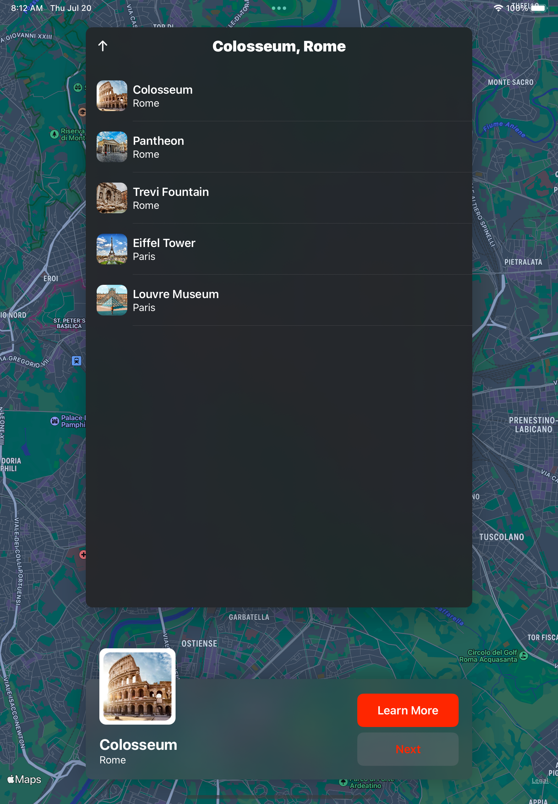
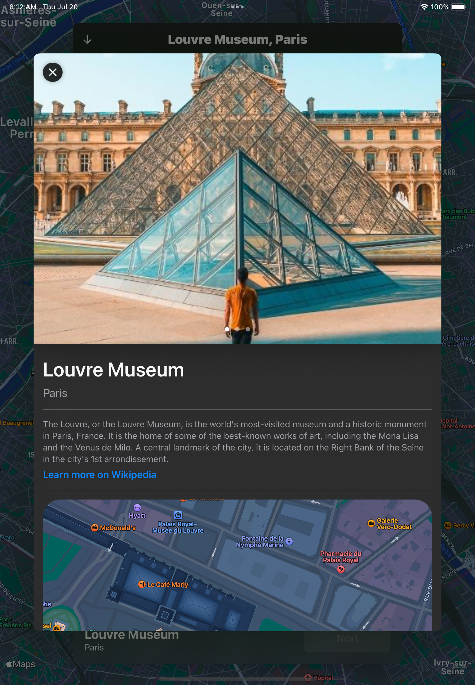

# Tourist Map

## Description

This app shows tourist info for a few popular spots in Europe. The location list is currently hard-coded and not very long, but the purpose of the app is to demonstrate UI features of SwiftUI.

## How to use this app

* download the repo locally and launch it using XCode
* run the app in a simulator, preferably an iPad so you can see the whole experience, but it's also built for iPhones too

## Screenshots

MapView

List View

Detail View

